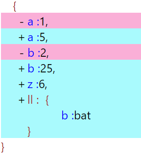

It is react component

installation npm i npm-json-diff-viewer

JsonDiff is component exported with baseJson and compareJson as  props

consider
baseJson = {"a": 1,"b": 2}
compareJson={ "a":5,"z": 6,"b":25,"ll":{"b":"bat"}}

```jsx
import {JsonDiff} from'npm-json-diff-viewer/dist/jsonDiff'

const baseJson = {"a": 1,"b": 2}
const compareJson={ "a":5,"z": 6,"b":25,"ll":{"b":"bat"}}

return (
<JsonDiff baseJson={baseJson} compareJson={compareJson}/>
)

```

output




